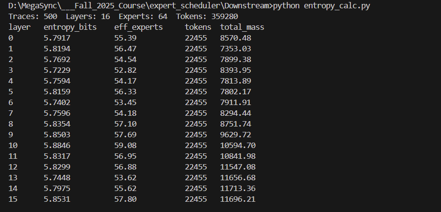

##

Overall: Entropy per layer is very high (≈5.72–5.88 bits out of a 6-bit max for 64 experts), and effective experts are ≈53–59. This means routing is broadly distributed—no layer is collapsing onto a few experts.

Layer variation: The lowest entropies are around layers 3 and 13 (~5.72–5.74 bits; ~53 effective experts), indicating only a mild concentration there. The highest is around layer 10 (~5.88 bits; 
~59 effective experts). The spread across layers is small, so routing remains diverse throughout.

Token coverage: Each layer aggregates the same token count (22,455), so differences are due to routing preferences, not sample size.

Takeaway for a report: This model exhibits consistently diverse expert usage with slight mid-layer dips but no strong specialization or collapse

##